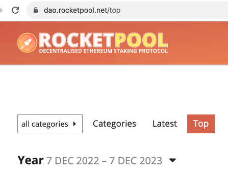
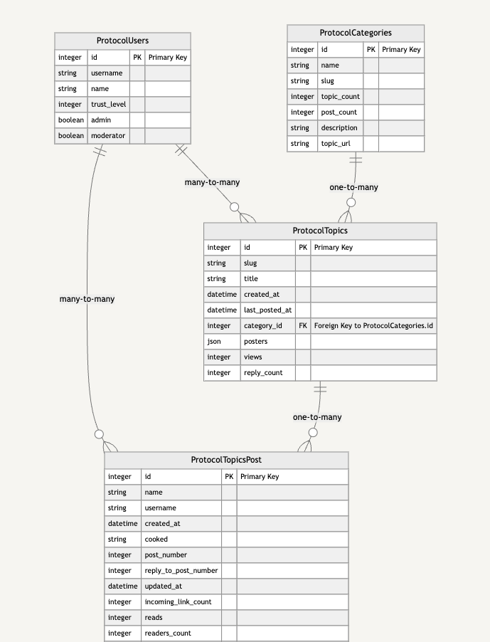
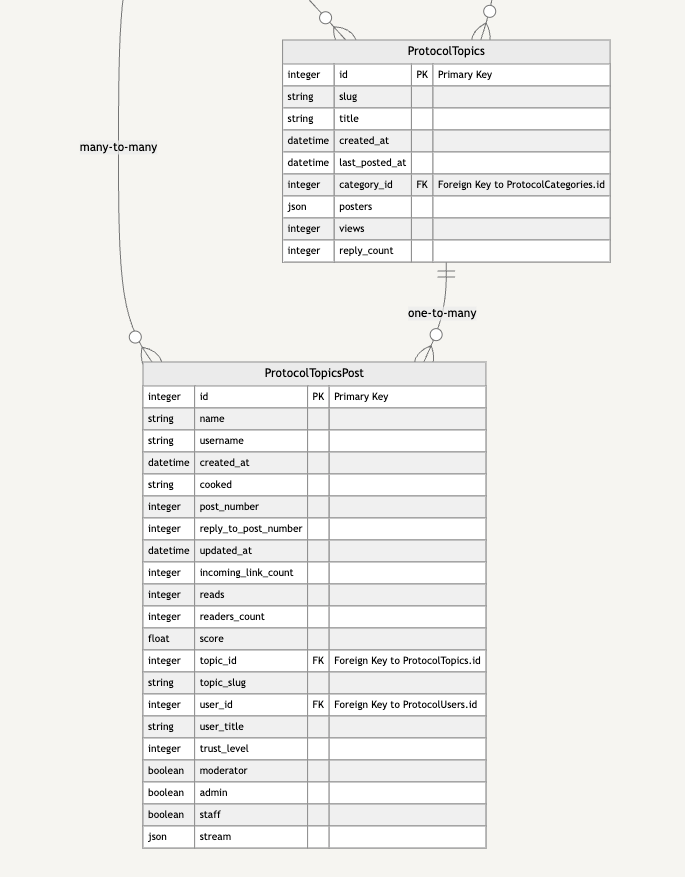

## Rocket Pool Discourse

### Overview

This repo contains exploratory and pipeline related scripts for navigating **Rocket Pool Discourse** data, creating initial data models and an initial pipeline for ingesting data for further processing. There is a SQLite database **rocketpool.db** that contains tables for discourse `categories`, `topics`, `posts` and `users`. The tables to reference are:

- protocol_categories
- protocol_users_pages
- protocol_topics_pages
- protocol_topics_post_pages

The database is **not** pushed into version control as it contains potentially *confidential* user data. 

The `pipeline` folder contains various scripts for creating SQLalchemy models and logic for the data pipeline.

### Discourse Data

Rocket Pool's discourse forum can filtered by categories, latest or top. 

There are currently 11 categories including: Governance, Liquid Staking Experience, Node Operator Experience, Community, Education, Growth, Integration, Grants / Bounties, Uncategorized and Polls. Selecting the "Categories" tab presents all categories, number of topics within and the latest posts.

Selecting the "Latest" tab presents a list of Topic Posts by recent Activity.

Selecting the "Top" tab presents a list of Topic Posts with the most Views/Replies. By default, the date range is set to showing posts within the last year (as of this writing Dec 7, 2022 - Dec 7, 2023). 

Here's a filter by "Top" topic posts:

### JSON 

So far data has been extracted by appending `.json` to the end of a URL for example:

`https://dao.rocketpool.net/top.json`

While we could filter by 'latest', we assume that filtering by 'top' will yield more relevant data.

### Data Model

Here's a visual database model for Rocket Pool's discourse forum data. An additional "page" attribute has been added to `users`, `topics` and `topic posts` to **paginate** through the data (see next section).

continue:

### Running the Pipeline

Running the pipeline creates a SQLite database: `rocketpool.db`, run the following commands (**note**: order matters where the `protocol_topics_post_pages` table relies on the `protocol_topics_pages` table for its creation, so the latter should be created first.)

Recommended order:

- category: `python -m category_model`
- user: `python -m user_model_pages`
- topic: `python -m topic_model_pages`
- post: `python -m topic_post_pipeline`

### Infinite Scrolling

discourse.org does not support native pagination despite repeated community requests over the years. These links provide background context ([July 2022](https://meta.discourse.org/t/is-pagination-impossible-or-just-hard/231838), [Nov 2023](https://meta.discourse.org/t/pagination-needed-for-post-or-topic-section/284921), [Dec 2023](https://meta.discourse.org/t/infinite-scrolling-on-homepage/288194/5))

Instead, discourse.org favors infinite scrolling. However, when using the `.json` approach for data extraction a web requests can only fetch a limited response. 

### Pagination with Pages

The good news is we can use the `page` parameter to create a **paginated URL**. 

For example, this:

url = f"https://dao.rocketpool.net/top.json"

becomes this:

paginated_url = f"https://dao.rocketpool.net/top.json?period=all&page={page}"

#### Page Index

Using the `page` parameter allows us to create a while-loop through all available page. Paired with the `period=all` parameter, we can get _all_ topics since inception of a discourse forum. Currently, we have successful implementation for

- topics 
- topic_posts 
- users

### New Data

Now that we have a rough working approach to pagination, we need a way to acquire and insert new data.
The approach i'm currently taking is to leverage a combination of **last page** and **updated_at** to start fetching data, then checking against existing topic_post `id` or inserting a new post. 

I'm experimenting by manually deleting specific posts, then re-running the pipeline to see if I can ingest those only (i.e., `ids`: 4755, 4791, 6112). 

### Rate Limits 

To deal with rate limiting (i.e., `status code 429`) the `topic_post_pipeline.py` we've implemnted **exponential backoff** into the pipeline. The pipeline can be adjusted to account for the last *page* a topic thread has to ingest any *new* post.

The challenge of running pipelines to fetch the latest discourse forum post involves a couple factors:
1. The topic threads differ in length (i.e. `page`)
2. The topic threads differ in last updated (i.e., `updated_at`)

Other options for running pipelines to fetch new data include:
1. Fetch all posts within a recent time frame
2. Check for gaps in post ids
3. Fetch data for specific topic threads (more active threads)
4. Combining strategies